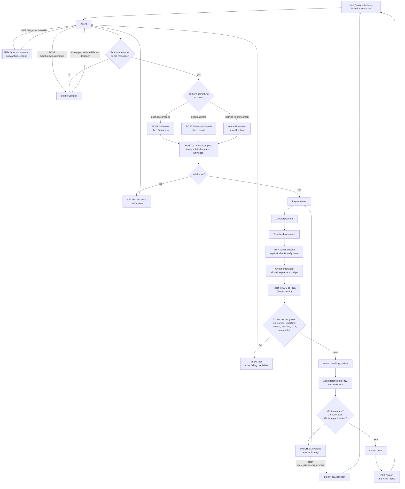

# What actually happens, end to end

A user opens an agent (Claude Code, or anything speaking MCP), says *"use flyero
and make me a birthday invitation for tomorrow"*, and eventually gets a poster.
This is what moves between them, in order, including every way it can stop.

No code here — just data and decisions.

---

## The cast

| Who | Knows | Decides |
|---|---|---|
| **User** | the brief, in plain words | whether the result is worth sending |
| **Agent** | the brief + our skills + the rendered PNG | what the flyer *says* and *shows* |
| **Flyero** | components, gates, geometry, colour | where everything goes and how it looks |

The split is the product. The agent never sends a coordinate, a hex colour or a
font. Flyero never invents a claim. Neither can do the other's job.

---

## The flow

---

## Step by step

### 1. The user asks

Plain words. "Birthday party tomorrow, warm, for friends and family." No format,
no size, no colours.

### 2. The agent reads the skills

`GET /v1/skills` — four short documents about **judgement**, not palettes:
what the flyer should show, how to write copy that survives the gates, how to
read a brief, and how to critique a render.

They contain no hex colours, no type scales and no font names, and a test
enforces that. If every agent were handed the same palette advice, every flyer
would converge — which is the exact failure the Studio Sampler exists to
prevent.

### 3. The agent asks for designers

`POST /v1/studio/assignments` returns **three lineages** from one job seed. Each
is a different "designer": a metaphor, a topology, a typography behaviour, a
material, a colour logic, a signature gesture and a graphic language — about 4.6
million combinations, sampled deterministically.

The agent picks the one whose **metaphor** fits the message, not the one whose
colours it likes. If none fits, it asks for another assignment. It cannot edit a
lineage; that is the point.

### 4. The agent finds something to show

Three paths:

- the user supplied images → upload, then optionally transform (crop, cut out)
- the brief needs a photo → search stock, review candidates, import one
- there is nothing to photograph → a drawn scene or a composed motif

A flyer for a *place*, a *dish* or an *object* with no picture of it cannot pass
the cover test, so this step is not optional for those briefs.

### 5. The agent composes

`POST /v1/flyers/compose` carries the idea, a four-beat story, the copy, and
**4–7 elements** — each naming a component, a role, and *why it is there*.
Practical facts (date, place, price) go in `details`, carried by one element
rather than one each.

If the spec breaks a rule the API returns **422 with the specific rule**, so the
next attempt is informed rather than a guess.

### 6. Flyero decides the geometry

The agent's part is over. In order:

1. elements are assigned to slots from the topology recipe
2. content shrinks or grows to what it actually needs
3. the headline is fitted
4. relationships and the one signature gesture are applied
5. collisions resolved, dead space closed, margins enforced
6. **the ground is planned** — flat, split, gradient, arch, pattern
7. **the tone field is measured** — a coarse map of what is where and how bright
8. **ink and scrims are chosen against that measurement**, not against an
   assumption
9. ornament is placed inside keep-out zones and a hard clutter budget
10. React → SVG → PNG, deterministic: same spec and seed, identical bytes

### 7. The gates run

**Code can settle these**, and does:

- G3 restraint (4–7 elements, each with a real reason)
- G5 exactly one signature gesture
- G6 no invented facts
- overflow, contrast, margins, CTA present, assets used, banned-list clear

**Code cannot settle these** — they are about the picture:

- G1 does the one idea read?
- G2 with the logo and headline covered, is the product still guessable?
- G4 does the type participate in the composition?

So the flyer stops at `awaiting_review`. It is **not done**, and the API says so.

### 8. The agent looks

Fetches the PNG and actually examines it: squint for a focal point, cover the
headline for the cover test, hunt for collisions. Then posts a verdict with
specifics.

Reporting `done` on a flyer nobody would print is the one failure this system
cannot recover from.

### 9. Revision, or an honest no

A rejection with concrete faults becomes **spec edits** — never coordinates —
and the layout is solved again from step 6. Capped at `MAX_REVISION_LOOPS`.

If it still fails, the job returns **`below_bar` with the best failing candidate
attached** and the reasons. That is a correct outcome, not an error.

### 10. Export

PNG, SVG (text stays text, groups named, self-contained), and `spec.json`. PDF
returns 501 in v1.

---

## Where it can stop, and what the user sees

| Condition | Result |
|---|---|
| No image for a brief that needs one | `below_bar` — cover test cannot pass |
| Invented statistic in the copy | 422 at compose, or G6 failure |
| More than 7 elements | 422 with the count |
| Two or more banned-list signals | `below_bar`, banned list |
| Text unreadable on its ground | mechanical contrast failure |
| Agent never reviews | stays `awaiting_review` — never silently "done" |
| Revisions exhausted | `below_bar` + best candidate + reasons |
| No provider key for stock images | 503 `not_configured` — the job still runs with what it has |

Nothing here degrades quietly. A flyer is `done` only when every gate passed and
a human-or-agent eye confirmed the three that code cannot judge.

---

## MCP versus REST

`src/mcp/` holds tool schemas and HTTP calls only — every capability is a REST
endpoint first. So the flow above is identical whether the agent speaks MCP or
calls the API directly. MCP adds discovery, not behaviour.
