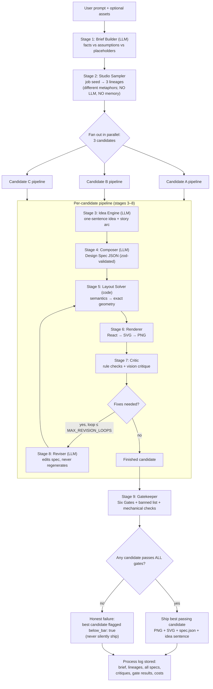
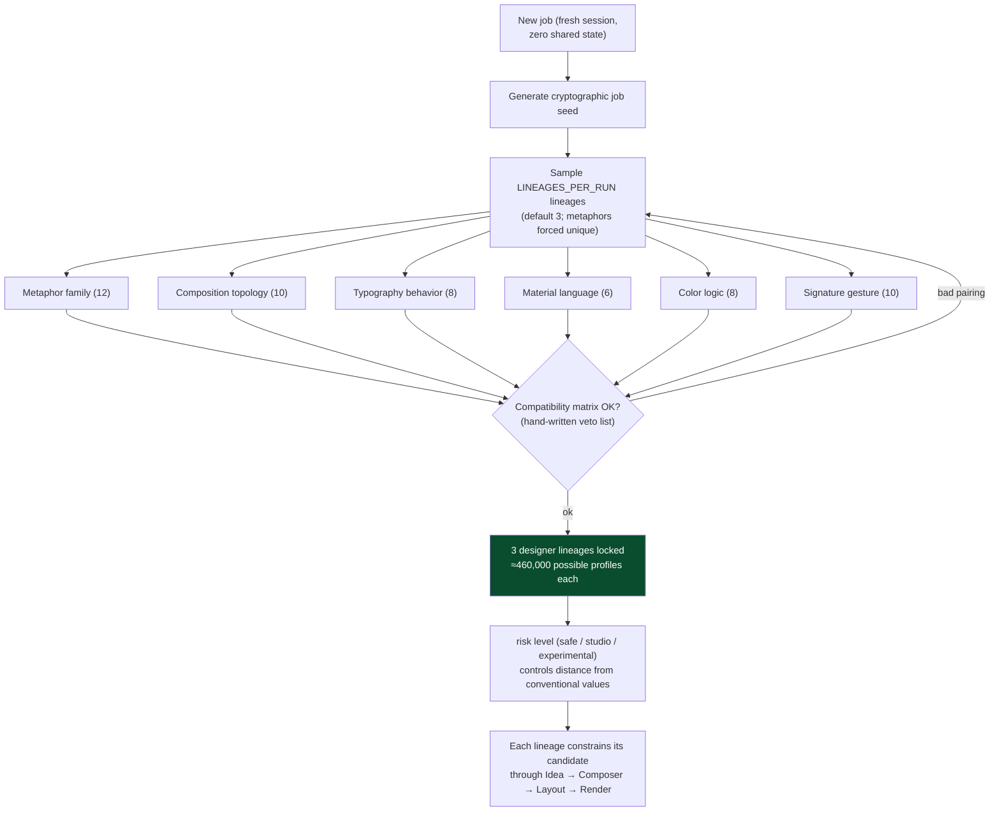
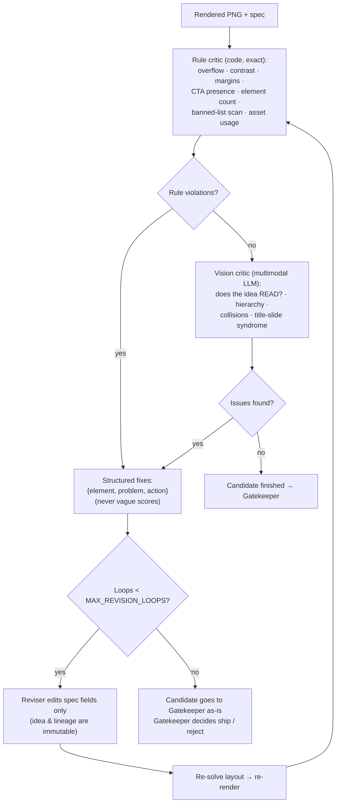
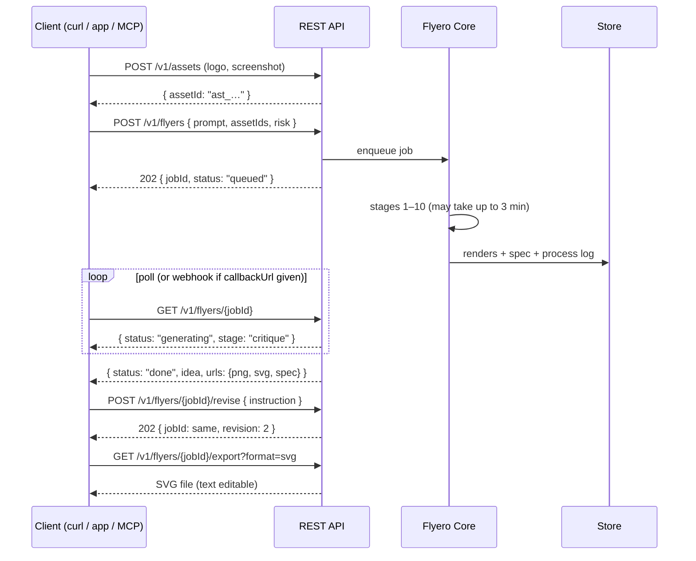
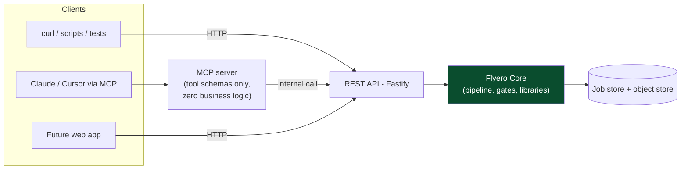
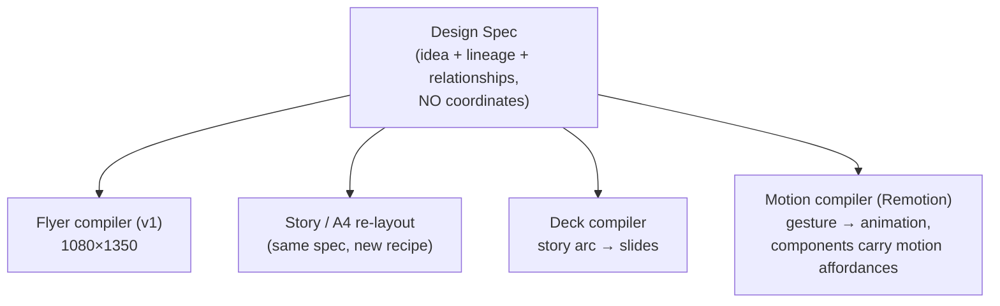

# Flyero — Flowcharts

*Visual reference for every flow in the system. Diagrams are Mermaid — they render on GitHub and in most IDE markdown previews.*

Companion docs: [`REQUIREMENTS.md`](./REQUIREMENTS.md) · [`ARCHITECTURE.md`](./ARCHITECTURE.md) · [`API.md`](./API.md)

---

## 1. End-to-end generation (one job)

## 2. The Studio Sampler — diversity by construction

**Why this equals human variance:** 10 humans differ because each arrives with different instincts *before seeing the brief*. Flyero re-rolls its instincts per **job**. Ten same-prompt sessions each get a fresh job seed and ship one winner — they land on different profiles by probability (~460k combinations), with no memory, tracking, or history lookup — exactly like ten independent designers.

## 3. Critique → revise loop (detail)

## 4. API request lifecycle (async job pattern)

## 5. Surfaces: API is the core, MCP is a skin

Rule: if a capability can't be exercised with `curl`, it doesn't exist yet. MCP tools (`upload_asset`, `prepare_asset`, `create_flyer`, `get_flyer`, `revise_flyer`, `export_flyer`, `create_flyer_batch`) map 1:1 to endpoints in [`API.md`](./API.md).

## 6. Future scaling of the same spec (not v1 — recorded so nothing is designed against it)

